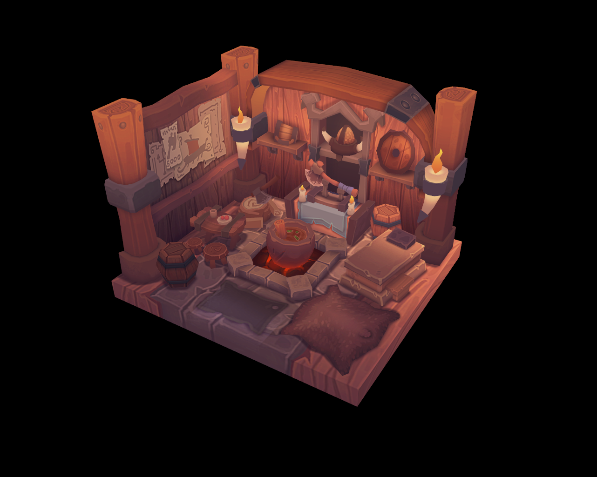

# Vulkan Tutorial

Followed the [Vulkan tutorial](vulkan-tutorial.com) to implement a simple graphics pipeline with Vulkan.

## Features
- Graphics pipeline from creation to presentation
-- Proper error and warning with the standard validation layer [VK_LAYER_KHRONOS_validation](https://vulkan.lunarg.com/doc/sdk/1.2.154.1/windows/validation_layers.html)
-- Examine device properties to create Vulkan instances of physical device, logical device and queue
-- Integrate with GLFW to create window surface for presentation
-- Create FIFO swap chain and image views to host rendered images and present to the window
-- Set up render pass and record commands in command buffer
-- Create structures to bind vertex/index buffer and MVP matrices to the device
-- Minimal vertex and fragment shaders compiled with glslc to render textured geometry
-- Handle resizing through swap chain recreation
- OBJ file loading and rendering through [tinyobjloader](https://github.com/tinyobjloader/tinyobjloader)
- Texture image mipmapping generation through [vkCmdBlitImage](https://www.khronos.org/registry/vulkan/specs/1.2-extensions/man/html/vkCmdBlitImage.html)
- Multi-sampling up to the device's maximal sample counts for color and depth buffers

## Usage
The application is created with Visual Studio 2019 in a Windows 10 (Macbook Bootcamp). After opening the repo with Visual Studio, correct the header and library dependency paths as instructed in the original tutorial - [Development Environment](https://vulkan-tutorial.com/Development_environment#page_Windows).

## Result
Final rendered image using the same assets as in the tutorial ([Viking Room model](https://sketchfab.com/3d-models/viking-room-a49f1b8e4f5c4ecf9e1fe7d81915ad38) by [nigeloh](https://sketchfab.com/nigelgoh) from SketchFab):
